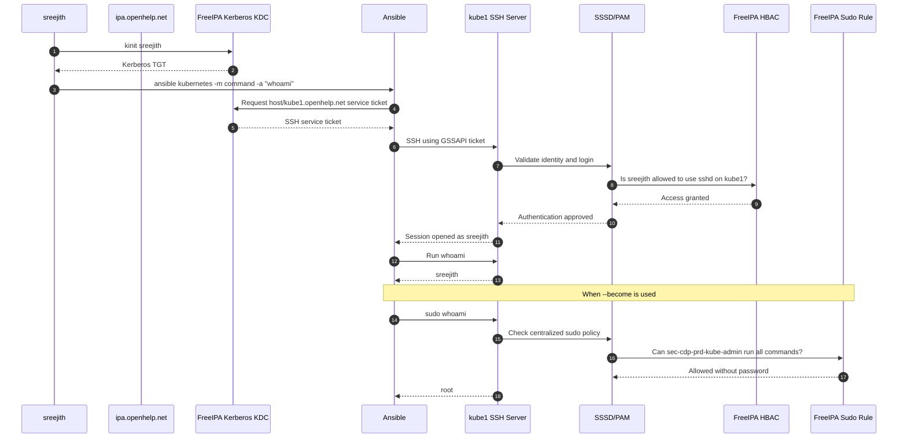
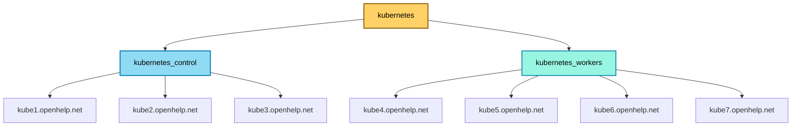
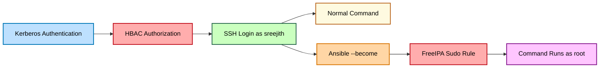
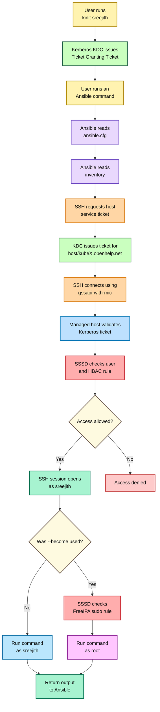

# Ansible with FreeIPA Kerberos GSSAPI SSH Authentication

## Complete Architecture, Configuration, Authentication Flow, and Examples

This guide documents the complete Ansible setup used for managing the Kubernetes servers:

- `kube1.openhelp.net`
- `kube2.openhelp.net`
- `kube3.openhelp.net`
- `kube4.openhelp.net`
- `kube5.openhelp.net`
- `kube6.openhelp.net`
- `kube7.openhelp.net`

The Ansible control node is:

- `ipa.openhelp.net`

Authentication is performed using:

- FreeIPA users and groups
- Kerberos tickets
- SSH GSSAPI authentication
- FreeIPA HBAC rules
- FreeIPA centralized sudo rules
- Ansible privilege escalation using `sudo`

---

# 1. Architecture Overview

## Components

| Component | Purpose |
|---|---|
| `ipa.openhelp.net` | FreeIPA server and Ansible control node |
| FreeIPA LDAP | Stores users, groups, hosts, HBAC rules, and sudo rules |
| Kerberos KDC | Issues Kerberos tickets |
| SSH client | Connects from the Ansible server to Kubernetes nodes |
| SSH server | Accepts GSSAPI authentication on Kubernetes nodes |
| SSSD | Connects Kubernetes nodes to FreeIPA |
| Ansible | Executes commands and playbooks remotely |
| Kubernetes nodes | Managed hosts `kube1` through `kube7` |

---

# 2. Color Architecture Diagram

```mermaid
flowchart LR
    U["Administrator<br/>sreejith"]:::user
    IPA["ipa.openhelp.net<br/>FreeIPA + Kerberos KDC<br/>Ansible Control Node"]:::ipa
    KRB["Kerberos Ticket Cache<br/>TGT + Service Ticket"]:::ticket
    INV["/etc/ansible/hosts<br/>Ansible Inventory"]:::config
    CFG["/etc/ansible/ansible.cfg<br/>GSSAPI SSH Configuration"]:::config
    SSH["SSH with GSSAPI<br/>gssapi-with-mic"]:::ssh
    SSSD["SSSD + PAM<br/>Identity and Access Check"]:::sssd
    HBAC["FreeIPA HBAC Rule<br/>kube-admin-ssh"]:::policy
    SUDO["FreeIPA Sudo Rule<br/>kube-admin-sudo"]:::policy
    CP["Control Plane Nodes<br/>kube1, kube2, kube3"]:::control
    WK["Worker Nodes<br/>kube4, kube5, kube6, kube7"]:::worker

    U -->|"1. kinit sreejith"| IPA
    IPA -->|"2. Issues TGT"| KRB
    INV --> IPA
    CFG --> IPA
    IPA -->|"3. Requests host service ticket"| KRB
    KRB -->|"4. SSH service ticket"| SSH
    SSH --> CP
    SSH --> WK

    CP --> SSSD
    WK --> SSSD
    SSSD -->|"Checks login authorization"| HBAC
    SSSD -->|"Checks sudo authorization"| SUDO
    HBAC --> IPA
    SUDO --> IPA

    classDef user fill:#fff3b0,stroke:#b08900,color:#000,stroke-width:2px;
    classDef ipa fill:#bde0fe,stroke:#0077b6,color:#000,stroke-width:2px;
    classDef ticket fill:#caffbf,stroke:#2d6a4f,color:#000,stroke-width:2px;
    classDef config fill:#e9d8fd,stroke:#6b46c1,color:#000,stroke-width:2px;
    classDef ssh fill:#ffd6a5,stroke:#d97706,color:#000,stroke-width:2px;
    classDef sssd fill:#ffc6ff,stroke:#a21caf,color:#000,stroke-width:2px;
    classDef policy fill:#ffadad,stroke:#c1121f,color:#000,stroke-width:2px;
    classDef control fill:#a0c4ff,stroke:#1d4ed8,color:#000,stroke-width:2px;
    classDef worker fill:#9bf6ff,stroke:#0e7490,color:#000,stroke-width:2px;
```



---

# 3. How Ansible Works in This Setup

When you run:

```bash
ansible kubernetes -m command -a "hostname"
```

the following happens:

1. Ansible reads `/etc/ansible/ansible.cfg`.
2. Ansible reads the inventory from `/etc/ansible/hosts`.
3. The inventory expands the `kubernetes` group into control-plane and worker nodes.
4. Ansible starts an SSH connection to each managed host.
5. SSH is forced to use `gssapi-with-mic`.
6. The SSH client uses the Kerberos ticket created by `kinit`.
7. Kerberos provides a service ticket for a host principal such as:

   ```text
   host/kube1.openhelp.net@OPENHELP.NET
   ```

8. The SSH server on the Kubernetes node validates the Kerberos ticket.
9. SSSD checks whether the FreeIPA user exists.
10. SSSD evaluates the FreeIPA HBAC rule.
11. If allowed, the SSH login succeeds as `sreejith`.
12. Ansible uploads or executes its temporary module.
13. When `--become` is used, Ansible runs the command through `sudo`.
14. SSSD checks the FreeIPA sudo rule.
15. The command runs as `root`.
16. Ansible collects and displays the output.

---

# 4. Kerberos and SSH Authentication Flow



---

# 5. Configure SSH Server GSSAPI Authentication

Run the following configuration on every managed host:

- `kube1`
- `kube2`
- `kube3`
- `kube4`
- `kube5`
- `kube6`
- `kube7`

Create a dedicated SSH server configuration drop-in:

```bash
sudo tee /etc/ssh/sshd_config.d/50-kerberos-gssapi.conf > /dev/null <<'EOF'
# Kerberos Authentication
GSSAPIAuthentication yes
GSSAPICleanupCredentials yes

# Allow Kerberos and Password Authentication
AuthenticationMethods any

# Enable password authentication
PasswordAuthentication yes
KbdInteractiveAuthentication yes
ChallengeResponseAuthentication yes

# Disable SSH keys (optional)
PubkeyAuthentication no

# Allow direct root login using password
PermitRootLogin yes

UsePAM yes
EOF
```

## What This Configuration Does

| Setting | Meaning |
|---|---|
| `GSSAPIAuthentication yes` | Enables Kerberos-based SSH authentication |
| `GSSAPICleanupCredentials yes` | Removes temporary GSSAPI credentials when the session closes |
| `AuthenticationMethods any` | Allows any enabled authentication method |
| `PasswordAuthentication yes` | Allows SSH password authentication |
| `KbdInteractiveAuthentication yes` | Allows keyboard-interactive authentication |
| `ChallengeResponseAuthentication yes` | Allows challenge-response authentication |
| `PubkeyAuthentication no` | Disables SSH public-key authentication |
| `PermitRootLogin yes` | Allows direct root login |
| `UsePAM yes` | Enables PAM and SSSD-based access checks |

> Production note: this configuration intentionally keeps password and root login available for troubleshooting. A hardened production system would normally restrict direct root login and disable password authentication after Kerberos access is fully tested.

## Validate the Configuration

```bash
sudo sshd -t
```

No output means the configuration syntax is valid.

## Restart SSH

```bash
sudo systemctl restart ssh
```

On distributions where the service is named `sshd`, use:

```bash
sudo systemctl restart sshd
```

---

# 6. Configure the SSH Client on the Ansible Host

Run this on:

```text
ipa.openhelp.net
```

Create the SSH client configuration:

```bash
sudo tee /etc/ssh/ssh_config.d/50-kerberos-gssapi.conf > /dev/null <<'EOF'
Host kube1 kube2 kube3 kube4 kube5 kube6 kube7
    HostName %h.openhelp.net
    GSSAPIAuthentication yes
    PreferredAuthentications gssapi-with-mic
    PubkeyAuthentication no
    PasswordAuthentication no
    KbdInteractiveAuthentication no
    GSSAPIDelegateCredentials no

Host kube1.openhelp.net kube2.openhelp.net kube3.openhelp.net kube4.openhelp.net kube5.openhelp.net kube6.openhelp.net kube7.openhelp.net
    GSSAPIAuthentication yes
    PreferredAuthentications gssapi-with-mic
    PubkeyAuthentication no
    PasswordAuthentication no
    KbdInteractiveAuthentication no
    GSSAPIDelegateCredentials no
EOF
```

## Restart SSHD

```bash
[root@ipa ssh_config.d]# systemctl restart sshd
```

The SSH client configuration normally does not require restarting `sshd`, but the command above is retained exactly as used in your setup.

---

# 7. Create the Shared Ansible Inventory

Edit:

```bash
vi /etc/ansible/hosts
```

Add:

```ini
[kubernetes_control]
kube1.openhelp.net
kube2.openhelp.net
kube3.openhelp.net

[kubernetes_workers]
kube4.openhelp.net
kube5.openhelp.net
kube6.openhelp.net
kube7.openhelp.net

[kubernetes:children]
kubernetes_control
kubernetes_workers

[kubernetes:vars]
ansible_become_method=sudo
ansible_python_interpreter=/usr/bin/python3
```

## Inventory Group Structure



## Set Ownership and Permissions

```bash
[root@ipa ssh_config.d]# chown root:sec-cdp-prd-kube-admin /etc/ansible/hosts
[root@ipa ssh_config.d]# chmod 0644 /etc/ansible/hosts
```

---

# 8. Create the Global Ansible Configuration

Edit:

```bash
vi /etc/ansible/ansible.cfg
```

Add:

```ini
[defaults]
inventory = /etc/ansible/hosts
host_key_checking = true
timeout = 30
forks = 20
interpreter_python = auto_silent
retry_files_enabled = false

[privilege_escalation]
become = false
become_method = sudo
become_ask_pass = false

[ssh_connection]
ssh_args = -o GSSAPIAuthentication=yes -o PreferredAuthentications=gssapi-with-mic -o PubkeyAuthentication=no -o PasswordAuthentication=no -o KbdInteractiveAuthentication=no -o ControlMaster=auto -o ControlPersist=60s
pipelining = true
```

## Configuration Explanation

| Setting | Purpose |
|---|---|
| `inventory` | Defines the default inventory file |
| `host_key_checking = true` | Protects against connecting to an unexpected SSH server |
| `timeout = 30` | Waits up to 30 seconds for connections |
| `forks = 20` | Allows up to 20 parallel Ansible operations |
| `interpreter_python = auto_silent` | Automatically selects Python on managed hosts |
| `retry_files_enabled = false` | Prevents creation of retry files |
| `become = false` | Does not use sudo unless requested |
| `become_method = sudo` | Uses sudo for privilege escalation |
| `become_ask_pass = false` | Does not ask for a sudo password |
| `PreferredAuthentications=gssapi-with-mic` | Forces Kerberos SSH authentication |
| `ControlMaster=auto` | Reuses SSH connections |
| `ControlPersist=60s` | Keeps the shared SSH connection open for 60 seconds |
| `pipelining = true` | Reduces the number of SSH operations |

## Set Ownership and Permissions

```bash
chown root:sec-cdp-prd-kube-admin /etc/ansible/ansible.cfg
chmod 0644 /etc/ansible/ansible.cfg
```

---

# 9. Configure Kerberos SSH Globally on the IPA Server

Create:

```bash
vi /etc/ssh/ssh_config.d/50-kubernetes-gssapi.conf
```

Add:

```sshconfig
Host kube1 kube2 kube3 kube4 kube5 kube6 kube7
    HostName %h.openhelp.net
    GSSAPIAuthentication yes
    PreferredAuthentications gssapi-with-mic
    PubkeyAuthentication no
    PasswordAuthentication no
    KbdInteractiveAuthentication no
    GSSAPIDelegateCredentials no

Host kube1.openhelp.net kube2.openhelp.net kube3.openhelp.net kube4.openhelp.net kube5.openhelp.net kube6.openhelp.net kube7.openhelp.net
    GSSAPIAuthentication yes
    PreferredAuthentications gssapi-with-mic
    PubkeyAuthentication no
    PasswordAuthentication no
    KbdInteractiveAuthentication no
    GSSAPIDelegateCredentials no
```

## Restart SSHD

```bash
[root@ipa ssh_config.d]# systemctl restart sshd
```

> The files `50-kerberos-gssapi.conf` and `50-kubernetes-gssapi.conf` contain similar client settings. Both are retained because they were part of your original procedure. In a cleaned-up deployment, one client file is usually enough.

---

# 10. Create the FreeIPA Administrator Group

Authenticate as the FreeIPA administrator:

```bash
kinit admin
```

Create the group:

```bash
ipa group-add sec-cdp-prd-kube-admin \
    --desc="Kubernetes Cluster Administrators"
```

Add the user:

```bash
ipa group-add-member sec-cdp-prd-kube-admin \
    --users=sreejith
```

Verify:

```bash
ipa group-show sec-cdp-prd-kube-admin
```

---

# 11. Create the Kubernetes Host Group

Create the host group:

```bash
ipa hostgroup-add kube-servers \
    --desc="All Kubernetes Servers"
```

Add all hosts:

```bash
ipa hostgroup-add-member kube-servers \
    --hosts=kube1.openhelp.net \
    --hosts=kube2.openhelp.net \
    --hosts=kube3.openhelp.net \
    --hosts=kube4.openhelp.net \
    --hosts=kube5.openhelp.net \
    --hosts=kube6.openhelp.net \
    --hosts=kube7.openhelp.net
```

Verify:

```bash
ipa hostgroup-show kube-servers
```

---

# 12. Create an HBAC Rule for SSH Access

HBAC means **Host-Based Access Control**.

It decides:

- Which user can log in
- To which host
- Using which service

Create the rule:

```bash
ipa hbacrule-add kube-admin-ssh \
    --desc="Allow Kubernetes Administrators to SSH"
```

Allow the IPA group:

```bash
ipa hbacrule-add-user kube-admin-ssh \
    --groups=sec-cdp-prd-kube-admin
```

Allow the Kubernetes hosts:

```bash
ipa hbacrule-add-host kube-admin-ssh \
    --hostgroups=kube-servers
```

Allow the SSH service:

```bash
ipa hbacrule-add-service kube-admin-ssh \
    --hbacsvcs=sshd
```

Test:

```bash
ipa hbactest \
    --user=sreejith \
    --host=kube1.openhelp.net \
    --service=sshd
```

Expected:

```text
Access granted: True
```

---

# 13. Create a Centralized Sudo Rule

Create the rule:

```bash
ipa sudorule-add kube-admin-sudo \
    --desc="Kubernetes Administrator Sudo Access"
```

Allow the IPA group:

```bash
ipa sudorule-add-user kube-admin-sudo \
    --groups=sec-cdp-prd-kube-admin
```

Apply the rule to Kubernetes hosts:

```bash
ipa sudorule-add-host kube-admin-sudo \
    --hostgroups=kube-servers
```

Allow all commands:

```bash
ipa sudorule-mod kube-admin-sudo \
    --cmdcat=all
```

Allow running commands as any user, including root:

```bash
ipa sudorule-mod kube-admin-sudo \
    --runasusercat=all
```

Disable the sudo password prompt:

```bash
ipa sudorule-add-option kube-admin-sudo \
    --sudooption='!authenticate'
```

Verify:

```bash
ipa sudorule-show kube-admin-sudo
```

---

# 14. Refresh SSSD on Kubernetes Hosts

Run on every Kubernetes node:

```bash
sudo sss_cache -E
sudo systemctl restart sssd
```

This clears cached identity, HBAC, group, and sudo information and forces the host to retrieve the latest policy from FreeIPA.

---

# 15. Log In Using Kerberos

Authenticate as a normal user:

```bash
kinit sreejith
```

Verify the Kerberos ticket:

```bash
klist
```

SSH to a node:

```bash
ssh kube1
```

Check sudo permissions:

```bash
sudo -l
```

You should see permission to run all commands.

Test:

```bash
sudo hostnamectl
```

or:

```bash
sudo reboot
```

No password prompt should appear.

---

# 16. Basic Ansible Authentication Test

## Normal Command Without Sudo

```bash
ansible kubernetes -m command -a "whoami"
```

Expected output:

```text
sreejith
```

## Privileged Command

```bash
ansible kubernetes -m command -a "whoami" --become
```

Expected output:

```text
root
```

---

# 17. Permission Test Without Privilege Escalation

Command:

```bash
[sreejith@ipa ~]$ ansible kubernetes -m shell -a "head -1 /etc/shadow"
```

Output:

```text
kube1.openhelp.net | FAILED | rc=1 >>
head: cannot open '/etc/shadow' for reading: Permission deniednon-zero return code
kube5.openhelp.net | FAILED | rc=1 >>
head: cannot open '/etc/shadow' for reading: Permission deniednon-zero return cod
```

This fails because `/etc/shadow` is readable only by root or authorized privileged processes.

---

# 18. Permission Test Using Sudo Inside the Command

Command:

```bash
[sreejith@ipa ~]$ ansible kubernetes -m shell -a "sudo head -1 /etc/shadow"
```

Output:

```text
kube1.openhelp.net | CHANGED | rc=0 >>
root:$y$j9T$.TIC7OpzcfIkdwSvs9DPC.$psmbhOlfxOb0J90pbo2OulHAgQNmVjURNmxH0M91xk2:20551:0:99999:7:::
kube5.openhelp.net | CHANGED | rc=0 >>
root:$y$j9T$GXFwy0d0RBPEHFuYqG6xU/$1GS6HbgNQIS35PZxZWr9Uxu63BK.LLicfD14NqinqC8:20579:0:99999:7:::
kube6.openhelp.net | CHANGED | rc=0 >>
```

Here, `sudo` is written directly inside the remote shell command.

---

# 19. Permission Test Using Ansible Become

Command:

```bash
[sreejith@ipa ~]$ ansible kubernetes -m shell -a "head -1 /etc/shadow" --become
```

Output:

```text
kube1.openhelp.net | CHANGED | rc=0 >>
root:$y$j9T$.TIC7OpzcfIkdwSvs9DPC.$psmbhOlfxOb0J90pbo2OulHAgQNmVjURNmxH0M91xk2:20551:0:99999:7:::
kube5.openhelp.net | CHANGED | rc=0 >>
root:$y$j9T$GXFwy0d0RBPEHFuYqG6xU/$1GS6HbgNQIS35PZxZWr9Uxu63BK.LLicfD14NqinqC8:20579:0:99999:7:::
```

This is the preferred Ansible method because privilege escalation is handled by Ansible.

---

# 20. Difference Between SSH Authentication and Sudo Authorization



Kerberos proves identity.

HBAC permits SSH access.

The sudo rule permits privileged commands.

These are three separate controls.

---

# 21. Sample Ansible Commands

The following examples use the groups from your inventory.

## 1. Test Connectivity to All Kubernetes Nodes

```bash
ansible kubernetes -m ping
```

This tests:

- Inventory resolution
- SSH connectivity
- Kerberos authentication
- Python availability
- Ansible module execution

Expected result:

```text
pong
```

---

## 2. Show the Logged-In Remote User

```bash
ansible kubernetes -m command -a "whoami"
```

Expected:

```text
sreejith
```

---

## 3. Show the Privileged User

```bash
ansible kubernetes -m command -a "whoami" --become
```

Expected:

```text
root
```

---

## 4. Display Hostnames

```bash
ansible kubernetes -m command -a "hostname"
```

---

## 5. Display Fully Qualified Domain Names

```bash
ansible kubernetes -m command -a "hostname -f"
```

---

## 6. Check System Uptime

```bash
ansible kubernetes -m command -a "uptime"
```

---

## 7. Check Operating-System Information

```bash
ansible kubernetes -m shell -a "cat /etc/os-release"
```

---

## 8. Check Disk Space

```bash
ansible kubernetes -m shell -a "df -h"
```

To check only the root filesystem:

```bash
ansible kubernetes -m shell -a "df -h /"
```

---

## 9. Check Memory Usage

```bash
ansible kubernetes -m command -a "free -h"
```

---

## 10. Check CPU Information

```bash
ansible kubernetes -m shell -a "lscpu | grep -E 'CPU\\(s\\)|Model name'"
```

---

## 11. Check Kubernetes Node Services

Check `kubelet`:

```bash
ansible kubernetes -m command -a "systemctl is-active kubelet" --become
```

Check `containerd`:

```bash
ansible kubernetes -m command -a "systemctl is-active containerd" --become
```

---

## 12. Restart Kubelet on All Nodes

```bash
ansible kubernetes -m service -a "name=kubelet state=restarted" --become
```

Use this carefully because restarting kubelet affects node management temporarily.

---

## 13. Restart Containerd on Worker Nodes

```bash
ansible kubernetes_workers -m service -a "name=containerd state=restarted" --become
```

---

## 14. Check SSSD Status

```bash
ansible kubernetes -m command -a "systemctl is-active sssd" --become
```

---

## 15. Refresh the SSSD Cache

```bash
ansible kubernetes -m shell -a "sss_cache -E && systemctl restart sssd" --become
```

---

## 16. Check SSH GSSAPI Configuration

```bash
ansible kubernetes -m shell -a "sshd -T | grep -Ei 'gssapiauthentication|passwordauthentication|pubkeyauthentication|permitrootlogin'" --become
```

---

## 17. Copy a File to All Nodes

Create a local file:

```bash
echo "Managed by Ansible" > /tmp/ansible-test.txt
```

Copy it:

```bash
ansible kubernetes -m copy -a "src=/tmp/ansible-test.txt dest=/tmp/ansible-test.txt mode=0644"
```

Verify:

```bash
ansible kubernetes -m command -a "cat /tmp/ansible-test.txt"
```

---

## 18. Create a Directory on All Nodes

```bash
ansible kubernetes -m file -a "path=/opt/openhelp state=directory owner=root group=root mode=0755" --become
```

---

## 19. Install a Package

On Ubuntu or Debian:

```bash
ansible kubernetes -m apt -a "name=jq state=present update_cache=yes" --become
```

On RHEL-compatible systems:

```bash
ansible kubernetes -m dnf -a "name=jq state=present" --become
```

---

## 20. Remove a Package

On Ubuntu or Debian:

```bash
ansible kubernetes -m apt -a "name=jq state=absent" --become
```

---

## 21. Check Listening Ports

```bash
ansible kubernetes -m shell -a "ss -lntp" --become
```

---

## 22. Check Node IP Addresses

```bash
ansible kubernetes -m command -a "ip -br address"
```

---

## 23. Check DNS Resolution

```bash
ansible kubernetes -m command -a "getent hosts ipa.openhelp.net"
```

---

## 24. Check Time Synchronization

```bash
ansible kubernetes -m command -a "timedatectl status"
```

Kerberos requires the clocks on the client, KDC, and managed hosts to be synchronized.

---

## 25. Reboot Worker Nodes

```bash
ansible kubernetes_workers -m reboot -a "reboot_timeout=600" --become
```

Run this carefully. For production Kubernetes clusters, reboot one worker at a time after draining it.

Example for one node:

```bash
ansible kube5.openhelp.net -m reboot -a "reboot_timeout=600" --become
```

---

# 22. Useful Ansible Inventory Commands

## List the Complete Inventory

```bash
ansible-inventory --list
```

## Display the Inventory as a Graph

```bash
ansible-inventory --graph
```

Expected structure:

```text
@all:
  |--@ungrouped:
  |--@kubernetes:
  |  |--@kubernetes_control:
  |  |  |--kube1.openhelp.net
  |  |  |--kube2.openhelp.net
  |  |  |--kube3.openhelp.net
  |  |--@kubernetes_workers:
  |  |  |--kube4.openhelp.net
  |  |  |--kube5.openhelp.net
  |  |  |--kube6.openhelp.net
  |  |  |--kube7.openhelp.net
```

## List Hosts in a Group

```bash
ansible kubernetes --list-hosts
```

## List Control-Plane Hosts

```bash
ansible kubernetes_control --list-hosts
```

## List Worker Hosts

```bash
ansible kubernetes_workers --list-hosts
```

---

# 23. Limit Operations to Specific Hosts

Run on one host:

```bash
ansible kube1.openhelp.net -m ping
```

Run on multiple hosts using a pattern:

```bash
ansible 'kube1.openhelp.net:kube2.openhelp.net' -m command -a "hostname"
```

Run on all nodes except one:

```bash
ansible 'kubernetes:!kube5.openhelp.net' -m command -a "hostname"
```

Run only on control-plane nodes:

```bash
ansible kubernetes_control -m command -a "hostname"
```

Run only on workers:

```bash
ansible kubernetes_workers -m command -a "hostname"
```

---

# 24. Recommended Kerberos Checks Before Running Ansible

Check the current ticket:

```bash
klist
```

If no valid ticket exists:

```bash
kinit sreejith
```

Check again:

```bash
klist
```

Test SSH directly:

```bash
ssh -vvv kube1
```

Look for messages similar to:

```text
Authentications that can continue: gssapi-with-mic
```

and:

```text
Authenticated to kube1.openhelp.net using "gssapi-with-mic"
```

Check whether a host service ticket was issued:

```bash
kvno host/kube1.openhelp.net
```

Display the ticket cache:

```bash
klist
```

You should see an entry similar to:

```text
host/kube1.openhelp.net@OPENHELP.NET
```

---

# 25. Troubleshooting Commands

## Validate SSH Server Configuration

```bash
sudo sshd -t
```

## Display Effective SSH Server Settings

```bash
sudo sshd -T | grep -Ei \
'gssapi|passwordauthentication|kbdinteractiveauthentication|pubkeyauthentication|permitrootlogin|usepam'
```

## Check SSH Service

Ubuntu:

```bash
sudo systemctl status ssh
```

RHEL or FreeIPA server:

```bash
sudo systemctl status sshd
```

## Check SSSD

```bash
sudo systemctl status sssd
```

## View SSSD Logs

```bash
sudo journalctl -u sssd -n 100 --no-pager
```

## View SSH Logs

Ubuntu:

```bash
sudo journalctl -u ssh -n 100 --no-pager
```

RHEL:

```bash
sudo journalctl -u sshd -n 100 --no-pager
```

## Confirm the IPA User Exists on a Managed Node

```bash
getent passwd sreejith
```

## Confirm IPA Group Membership

```bash
id sreejith
```

## Test HBAC from the IPA Server

```bash
ipa hbactest \
    --user=sreejith \
    --host=kube1.openhelp.net \
    --service=sshd
```

## Check Centralized Sudo Rules on a Node

```bash
sudo -l
```

## Refresh Cached FreeIPA Policies

```bash
sudo sss_cache -E
sudo systemctl restart sssd
```

## Test Ansible with Verbose SSH Output

```bash
ansible kube1.openhelp.net -m ping -vvvv
```

---

# 26. Important Security Notes

Your server-side SSH configuration allows:

```text
PasswordAuthentication yes
PermitRootLogin yes
```

This provides an emergency troubleshooting path, but it increases the attack surface.

After Kerberos authentication is stable, a more restrictive configuration could be:

```sshconfig
GSSAPIAuthentication yes
PasswordAuthentication no
KbdInteractiveAuthentication no
PubkeyAuthentication no
PermitRootLogin no
AuthenticationMethods gssapi-with-mic
UsePAM yes
```

Do not apply this hardened configuration until all nodes have been tested successfully through Kerberos and an emergency console-access method is available.

Also avoid displaying `/etc/shadow` in normal operational work. It contains password hashes and should be treated as sensitive data.

---

# 27. Simple End-to-End Example

## Step 1: Obtain a Kerberos Ticket

```bash
kinit sreejith
```

## Step 2: Verify the Ticket

```bash
klist
```

## Step 3: Test Direct SSH

```bash
ssh kube1
```

## Step 4: Test Ansible Connectivity

```bash
ansible kubernetes -m ping
```

## Step 5: Run a Normal Command

```bash
ansible kubernetes -m command -a "whoami"
```

Expected:

```text
sreejith
```

## Step 6: Run a Root Command

```bash
ansible kubernetes -m command -a "whoami" --become
```

Expected:

```text
root
```

## Step 7: Check Kubernetes Services

```bash
ansible kubernetes -m shell -a "systemctl is-active kubelet && systemctl is-active containerd" --become
```

---

# 28. Complete Backend Flow Summary



---

# 29. Final Result

With this configuration:

- FreeIPA manages users and groups centrally.
- Kerberos provides passwordless identity authentication.
- SSH uses GSSAPI instead of SSH keys.
- HBAC controls who can log in to Kubernetes nodes.
- FreeIPA sudo rules control who can run privileged commands.
- SSSD downloads and enforces FreeIPA policies.
- Ansible uses the Kerberos-authenticated SSH session.
- Commands run as the normal user by default.
- Commands run as root when `--become` is supplied.
